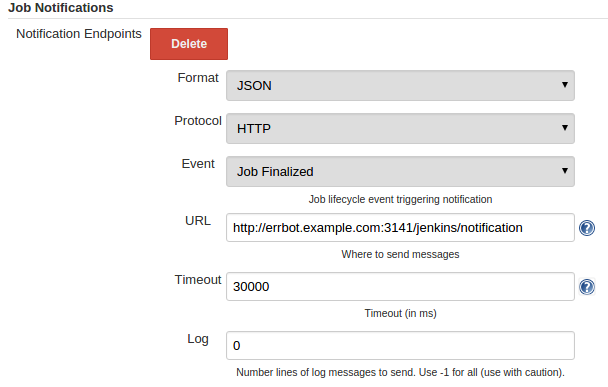

# err-jenkins - Jenkins plugin for Err

[](https://travis-ci.org/Djiit/err-jenkins) [](https://coveralls.io/github/Djiit/err-jenkins?branch=master)

Err-jenkins is a plugin for [Err](https://github.com/gbin/err) that allows you to interact with [Jenkins](http://jenkins-ci.org), a continuous integration tool.

## Features

* Support Jenkins 2.x!
* Search / List available jobs.
* List parameters for a given job.
* Create job (workflow-plugin / pipeline only)
* Build jobs with or without parameters.
* Webhook support! Send message on build success/failure
* Tested with freestyle and pipeline (workflow plugin) jobs.
* Support AUTOINSTALL_DEPS thanks to the `requirements.txt` file.

Have an idea ? Open an [issue](https://github.com/Djiit/err-jenkins/issues) or send me a [Pull Request](https://github.com/Djiit/err-jenkins/pulls).

## Usage

### Requirements

This plugin is tested against Python 2.7+ and 3.3+. It only depends on the `python-jenkins` and `validators` packages:

```bash
pip install python-jenkins
```

### Installation

As admin of an err chatbot, send the following command over XMPP:

```
!repos install https://github.com/Djiit/err-jenkins.git
```

### Commands

Use `!help JenkinsBot` to see the available commands and their explanation.

## Configuration

You can set some default configuration values in your Errbot's `config.py`:

```python
# Main configuration
JENKINS_URL = 'http://jenkins.example.com'  # Must begins with 'http' or 'https'.
JENKINS_USERNAME = 'myuser'  # Make sure Jenkins ACL is configured.
JENKINS_PASSWORD = 'mypassword'  # Use a password or token.

# Webhooks configuration
JENKINS_RECEIVE_NOTIFICATION = True  # If True, this plugin will accept HTTP POST from Jenkins (see configuration below).
JENKINS_CHATROOMS_NOTIFICATION = ()  # Tuples of chatroom names where Err should post messages from Webhooks. If left empty, all chatrooms will be spammed.
```

If left undefined, you will have to send configuration commands through chat message to this plugins as in :

```
!plugin config JenkinsBot {'URL': 'http://jenkins.example.com', 'USERNAME': 'myuser', 'PASSWORD': 'mypassword', 'RECEIVE_NOTIFICATION': True, 'CHATROOMS_NOTIFICATION': ()}
```

### Webhooks setup

To be able to receive messages based on build success and/or failure :

1. Set `JENKINS_RECEIVE_NOTIFICATION` (in config.py) or `RECEIVE_NOTIFICATION`' (through chat message) configuration option to `True`.
2. Install and enable the [Jenkins Notification Plugin](https://wiki.jenkins-ci.org/display/JENKINS/Notification+Plugin)
3. Configure your project's notifications as in :

[](#)

## Credits

This plugin is based on the original work by [benvd](https://github.com/benvd/err-jenkins).
